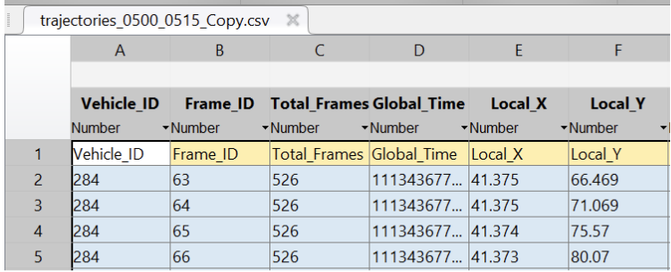
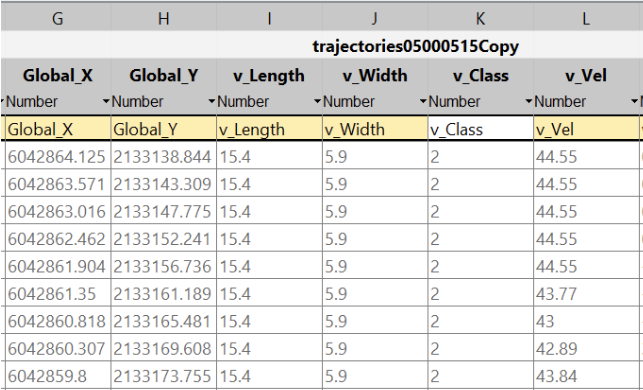
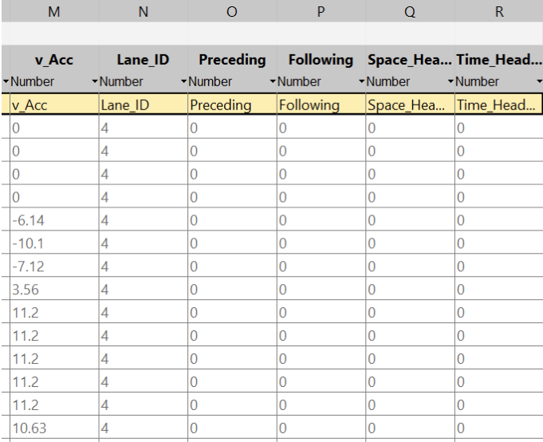
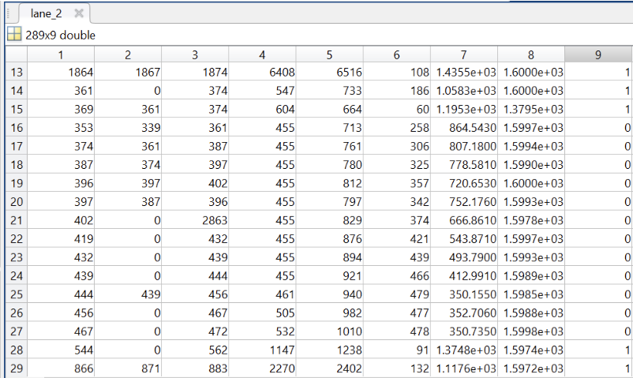
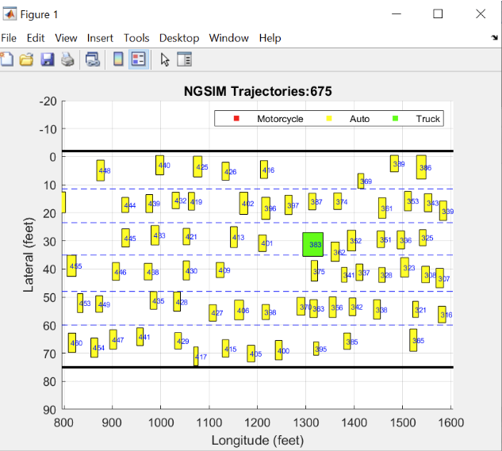

NGSIM DATA PROCESSING
===============
#### Robotics and Intelligent Vehicle Automation Lab (RIVAL)
- Built by Dong Chen, [Zhaojian Li](https://www.egr.msu.edu/rival/) from Michigan State University
- Started on Oct.23, 2019, Lastly updated on Oct.25, 2019

Overview
-------

This resposity aims at building car following dataset. We use a subset of NGSIM dataset, full dataset can be found [here](https://data.transportation.gov/Automobiles/Next-Generation-Simulation-NGSIM-Vehicle-Trajector/8ect-6jqj).

#### Motivation:
Next Generation Simulation (NGSIM) program collected vehicle trajectory data on southbound US 101 and Lankershim Boulevard in Los Angeles, CA, eastbound I-80 in Emeryville, CA and Peachtree Street in Atlanta, Georgia. We want to find the trajectories of vehicles and fit the data to our car-following model. This resposity aims at find sequences of vehicles and corresponding trajectory information where the vehicles inside the sequences follow each other without lane changing or extra vehicles enter the sequences during a time interval.

Part1. Lane Change Analysis
-------
There are three subdataset. We use the dataset *Data-0500-0515* of Next Generation Simulation (NGSIM) Interstate 80 Freeway
Dataset. You can find the dataset analysis from the [Attachments](https://data.transportation.gov/Automobiles/Next-Generation-Simulation-NGSIM-Vehicle-Trajector/8ect-6jqj). The dataset shows like this.

     
      Fig.1 Column 1-6 of Data-0500-0515

     
      Fig.2 Column 7-12 of Data-0500-0515

     
      Fig.3 Column 13-18 of Data-0500-0515

We can find the same vehicle (Vehicle_ID) occurs many time as the dataset shows the trajectory for each vehicle in frame (the frame rate is 15). 

The code in [data_process.m](/data_process.m) processes the trajectory information for each car. For each lane, there is a file **lane_analysis_X.mat** in the **/lane_analysis/** folder. 

     
      Fig.4 Output of 2nd Lane Analysis

Columns are Vehicle_ID, Preceding, Forwarding, start_frame, end_frame, total_frames, start_y, end_y, lane_change_flag. That's the information related to each vehicle arranged in the order of entering time. Here we can see that the sequence of vehicles with Vehicle_ID 353--> 374--> 387 --> ... ---> 367 meets our requirement, as there is no lane changing event happening (lane_change_flag is 0). We can also use the trajectory plotting to prove that.

Part2. Trajectory Plotting
-------

We can plot the trajectories of vehicles over time frames. The code in [plot_trajectories.m](/plot_trajectories.m) does trajectory plotting.

     
      Fig.5 trajectory_plotting

Part3. Data Saving
-------
The code in [save_data.m	](/save_data.m) saves the vehicle and related information.

Reference
----------
[1]. [Next Generation Simulation (NGSIM) Vehicle Trajectories and Supporting DataAutomobiles](https://data.transportation.gov/Automobiles/Next-Generation-Simulation-NGSIM-Vehicle-Trajector/8ect-6jqj)
[2]. 

